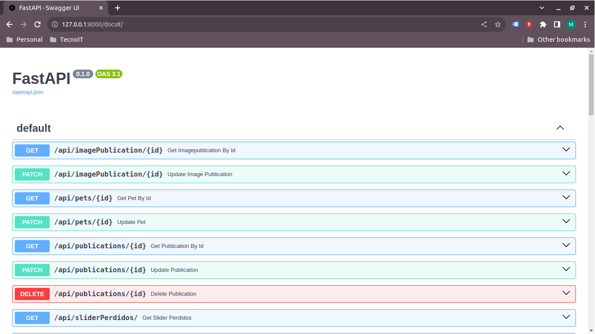

<!-- Improved compatibility of volver arriba link: See: https://github.com/othneildrew/Best-README-Template/pull/73 -->
<a name="readme-top"></a>
<!--
*** Thanks for checking out the Best-README-Template. If you have a suggestion
*** that would make this better, please fork the repo and create a pull request
*** or simply open an issue with the tag "enhancement".
*** Don't forget to give the project a star!
*** Thanks again! Now go create something AMAZING! :D
-->


<!-- PROJECT SHIELDS -->
<!--
*** I'm using markdown "reference style" links for readability.
*** Reference links are enclosed in brackets [ ] instead of parentheses ( ).
*** See the bottom of this document for the declaration of the reference variables
*** for contributors-url, forks-url, etc. This is an optional, concise syntax you may use.
*** https://www.markdownguide.org/basic-syntax/#reference-style-links
-->
[![Contributors][contributors-shield]][contributors-url]
[![Forks][forks-shield]][forks-url]
[![Stargazers][stars-shield]][stars-url]
[![Issues][issues-shield]][issues-url]
[![MIT License][license-shield]][license-url]
<!-- [![LinkedIn][linkedin-shield]][linkedin-url] -->


<!-- PROJECT LOGO -->
<br />
<div align="center">
  <a href="https://github.com/mikelm2020/video-streaming.git">
    
  </a>

  <h3 align="center">Web App petfinder</h3>

  <p align="center">
    Una aplicación para encontrar a tu mascota!
    <!-- <br />
    <a href="https://github.com/No-Country/c13-21-m-python.git"><strong>Explore the docs »</strong></a> -->
    <br />
    <br />
    <a href="https://master.d1ekwa4aggp54t.amplifyapp.com/">Ver Demo</a>
    ·
    <a href="https://github.com/No-Country/c13-21-m-python.git/issues">Reportar Bug</a>
    ·
    <a href="https://github.com/No-Country/c13-21-m-python.git/issues">Solicitar Función</a>
  </p>
</div>


<!-- TABLE OF CONTENTS -->
<details>
  <summary>Tabla de contenido</summary>
  <ol>
    <li>
      <a href="#Acerca del Proyecto">Acerca del proyecto</a>
      <ul>
        <li><a href="#Construido con">Construido con</a></li>
      </ul>
    </li>
    <li>
      <a href="#Inicio">Inicio</a>
      <ul>
        <li><a href="#Prerequisitos">Prerequisitos</a></li>
        <li><a href="#Instalación">Instalación</a></li>
      </ul>
    </li>
    <li><a href="#Uso">Uso</a></li>
    <li><a href="#Roadmap">Roadmap</a></li>
    <!-- <li><a href="#contributing">Contribución</a></li> -->
    <li><a href="#Licencia">Licencia</a></li>
    <li><a href="#Integrantes">Integrantes</a></li>
    <li><a href="#Despliegue">Despliegue</a></li>
  </ol>
</details>


<!-- ABOUT THE PROJECT -->
# Acerca del Proyecto

API


App Home


App Detalle


Diseñar y Desarrollar una plataforma en línea que ayude a los dueños 
de mascotas a reportar y buscar animales perdidos, además de facilitar 
la adopción responsable de mascotas en todo el país.

Los objetivos del proyecto son:
* Crear una base de datos de PostgreSQL en la Nube  a traves del servicio de Amazon RDS y utilizando el ORM SQL Alchemy
* Crear una REST API para las operaciones CRUD mediante FastAPI y desplegar en un servidor virtual con los servicios de Amazon EC2
* Usar Swagger para documentar la REST API
* Crear el frontend mediante Typescript y desplegar con Nextjs
* Desplegar la aplicación en un servidor virtual en la Nube mediante AWS Amplify


<p align="right">(<a href="#readme-top">volver arriba</a>)</p>


# Construido con

Estas son las tecnoogías utilizadas:

## Backend

* [![Python][Python]][Python-url]
* [![FastAPI][FastAPI]][FastAPI-url]
* [![Swagger][Swagger]][Swagger-url]
* [![AWS][AWS]][AWS-url]
* [![Postgres][Postgres]][Postgres-url]

## Frontend

* [![Next JS][Next JS]][Next JS-url]
* [![Typescript][Typescript]][Typescript-url]
* [![TailwindCSS][TailwindCSS]][TailwindCSS-url]
* [Context][Context-url]
* [NextAuth][NextAuth-url]

## Diseño UX/UI

* [![Figma][Figma]][Figma-url]
* [Miro][Miro-url]

## Proyect Manager

* [![Jira][Jira]][Jira-url]
* [![Slack][Slack]][Slack-url]
* [![Discord][Discord]][Discord-url]
* [![Google Meet][Google Meet]][Google Meet-url]

## Otros

* [![ChatGPT][ChatGPT]][ChatGPT-url]

<p align="right">(<a href="#readme-top">volver arriba</a>)</p>


<!-- GETTING STARTED -->
# Inicio


## Prerequisitos

Este proyecto usa una base de datos PostgreSQL mediante Amazon RDS, pero pueden implementarlo con una base local, sólo hay que definir las variables de entorno en el servidor del Backend.
Las variables son las siguientes:

| Variable | Descripción |
| --- | --- |
| `DB_HOST` | El nombre del servidor de base de datos |
| `DB_PORT` | El puerto del servidor que usa la base de datos |
| `DB_USER` | El usuario registrado para la base de datos |
| `DB_PASSWORD` | La contraseña del usuario |
| `DB_NAME` | El nombre de la base de datos |
| `AWS_ACCESS_KEY` | El accesskey de la cuenta de AWS |
| `AWS_SECRET_KEY` | El secretkey de la cuenta de AWS |
| `BUCKET_NAME` | El nombre del bucket S3 que almacena las fotos de las mascotas |
| `REGION_NAME` | Crear una carpeta llamada fotos en el bucket de S3 |

## Instalación

### Backend
1. Clonar el repositorio en el servidor del Backed
   ```sh
   git clone https://github.com/No-Country/c13-21-m-python.git.git
   ```
2. Crear un ambiente virtual de Python para el backend
3. Preparar ambiente virtual mediante el archivo  requirements.txt
   ```sh
   pip install -r requirements.txt
   ```
### Frontend
1. Clonar el repositorio en el servidor del Frontend
   ```sh
   npx create-next-app nextjs-fastapi --example https://github.com/No-Country/c13-21-m-python.git.git
   ```
2. Primero instalar las dependencias:

```bash
npm install
# or
yarn
# or
pnpm install
```
3. Instalar el servidor de producción

<p align="right">(<a href="#readme-top">volver arriba</a>)</p>


<!-- USAGE EXAMPLES -->
# Uso

Entrar a la aplicación 
1. Puede revisar las publicaciones de las mascotas: perdidas, encontradas, en adopción y adopatadas
2. Puede crear una publicación subiendo la foto y datos de las mascotas

<p align="right">(<a href="#readme-top">volver arriba</a>)</p>


<!-- ROADMAP -->
# Roadmap

- [ ] Agregar acceso a usuarios registrados mediante validación de correo
- [ ] Agregar perfil de usuario
- [ ] Compartir las publicaciones mediante redes sociales


<!-- See the [open issues](https://github.com/No-Country/c13-21-m-python.git/issues) for a full list of proposed features (and known issues). -->

<p align="right">(<a href="#readme-top">volver arriba</a>)</p>


<!-- CONTRIBUTING -->
<!-- ## Contributing

Contributions are what make the open source community such an amazing place to learn, inspire, and create. Any contributions you make are **greatly appreciated**.

If you have a suggestion that would make this better, please fork the repo and create a pull request. You can also simply open an issue with the tag "enhancement".
Don't forget to give the project a star! Thanks again!

1. Fork the Project
2. Create your Feature Branch (`git checkout -b feature/AmazingFeature`)
3. Commit your Changes (`git commit -m 'Add some AmazingFeature'`)
4. Push to the Branch (`git push origin feature/AmazingFeature`)
5. Open a Pull Request -->

<!-- <p align="right">(<a href="#readme-top">volver arriba</a>)</p> -->


<!-- LICENSE -->
# Licencia

Distribuido bajo licencia MIT. Ver `LICENSE.txt` para más información.

<p align="right">(<a href="#readme-top">volver arriba</a>)</p>


<!-- CONTACTO -->
# Integrantes

#### Diseñadora UX/UI
Mariela Sol Erramuspe - erramuspe.mariela@gmail.com

#### Proyect Manager
Magdalena Prieto - magdalenaprietoo@gmail.com

#### Frontend Developer
Noe Alonso - nalonsor@outlook.com

#### Backend Developer
Juan Manuel Rodriguez - rodrjm94@gmail.com

Miguel Angel López Monroy - miguel.lopezm.dev@gmail.com


<p align="right">(<a href="#readme-top">volver arriba</a>)</p>


<!-- ACKNOWLEDGMENTS -->
# Despliegue

Link del proyecto: [https://master.d1ekwa4aggp54t.amplifyapp.com/](https://master.d1ekwa4aggp54t.amplifyapp.com/)

<!-- * [Choose an Open Source License](https://choosealicense.com)
* [Django Documentation](https://docs.djangoproject.com/en/4.1/)
* [Django Rest Framework Documentation](https://www.django-rest-framework.org/)
* [Django Class Based View Inspector](http://ccbv.co.uk/)
* [Classy Django Rest Framework](https://www.cdrf.co/)
* [Platzi Platform](https://platzi.com/)
* [Udemy Platform](https://www.udemy.com/)
* [Real Python Tutorials](https://realpython.com/)
* [Blog Developer.pe](http://www.developerpe.com/) -->

<p align="right">(<a href="#readme-top">volver arriba</a>)</p>


<!-- MARKDOWN LINKS & IMAGES -->
<!-- https://www.markdownguide.org/basic-syntax/#reference-style-links -->
[contributors-shield]: https://img.shields.io/github/contributors/mikelm2020/video-streaming.svg?style=for-the-badge
[contributors-url]: https://github.com/No-Country/c13-21-m-python.git/graphs/contributors
[forks-shield]: https://img.shields.io/github/forks/mikelm2020/video-streaming.svg?style=for-the-badge
[forks-url]: https://github.com/No-Country/c13-21-m-python.git/network/members
[stars-shield]: https://img.shields.io/github/stars/mikelm2020/video-streaming.svg?style=for-the-badge
[stars-url]: https://github.com/No-Country/c13-21-m-python.git/stargazers
[issues-shield]: https://img.shields.io/github/issues/mikelm2020/video-streaming.svg?style=for-the-badge
[issues-url]: https://github.com/No-Country/c13-21-m-python.git/issues
[license-shield]: https://img.shields.io/github/license/mikelm2020/video-streaming.svg?style=for-the-badge
[license-url]: https://github.com/No-Country/c13-21-m-python.git/blob/master/LICENSE.txt
[linkedin-shield]: https://img.shields.io/badge/-LinkedIn-black.svg?style=for-the-badge&logo=linkedin&colorB=555
[linkedin-url]: https://linkedin.com/in/miguellopezmdev
[product-screenshot]: https://github.com/No-Country/c13-21-m-python.git/blob/82a8c694a418723faacf992c5dd76b6e328120f8/api_playlists.png
[Python]: https://img.shields.io/badge/python-3670A0?style=for-the-badge&logo=python&logoColor=ffdd54
[Python-url]: https://www.python.org/
[FastAPI]: https://img.shields.io/badge/FastAPI-005571?style=for-the-badge&logo=fastapi
[FastAPI-url]: https://fastapi.tiangolo.com/es/
[Swagger]: https://img.shields.io/badge/-Swagger-%23Clojure?style=for-the-badge&logo=swagger&logoColor=white
[Swagger-url]: https://swagger.io/
[AWS]: https://img.shields.io/badge/AWS-%23FF9900.svg?style=for-the-badge&logo=amazon-aws&logoColor=white
[AWS-url]: https://docs.aws.amazon.com/es_es/
[Postgres]: https://img.shields.io/badge/postgres-%23316192.svg?style=for-the-badge&logo=postgresql&logoColor=white
[Postgres-url]: https://www.postgresql.org/

[Next JS]: https://img.shields.io/badge/Next-black?style=for-the-badge&logo=next.js&logoColor=white
[Next JS-url]: https://nextjs.org/
[TailwindCSS]: https://img.shields.io/badge/tailwindcss-%2338B2AC.svg?style=for-the-badge&logo=tailwind-css&logoColor=white
[TailwindCSS-url]: https://tailwindcss.com/
[Typescript]: https://img.shields.io/badge/typescript-%23007ACC.svg?style=for-the-badge&logo=typescript&logoColor=white
[Typescript-url]: https://www.typescriptlang.org/
<!-- [NeaxtAuth]: https://img.shields.io/badge/postgres-%23316192.svg?style=for-the-badge&logo=postgresql&logoColor=white
[NeaxtAuth]: https://www.postgresql.org/ -->

[Figma]: https://img.shields.io/badge/figma-%23F24E1E.svg?style=for-the-badge&logo=figma&logoColor=white
[Figma-url]: https://www.figma.com/
[Jira]: https://img.shields.io/badge/jira-%230A0FFF.svg?style=for-the-badge&logo=jira&logoColor=whitelogo=tailwind-css&logoColor=white
[Jira-url]: https://magdalenaprietoo.atlassian.net/jira/software
[Slack]: https://img.shields.io/badge/Slack-4A154B?style=for-the-badge&logo=slack&logoColor=white
[Slack-url]: https://app.slack.com/
[Discord]: https://img.shields.io/badge/Discord-%235865F2.svg?style=for-the-badge&logo=discord&logoColor=white
[Discord-url]: https://discord.com/
[Google Meet]: https://img.shields.io/badge/Google%20Meet-00897B?style=for-the-badge&logo=google-meet&logoColor=white
[Google Meet-url]: https://meet.google.com/
[ChatGPT]: https://img.shields.io/badge/chatGPT-74aa9c?style=for-the-badge&logo=openai&logoColor=white
[ChatGPT-url]: https://chat.openai.com/

[Context]: Context
[Context-url]: https://context.ai/
[NextAuth]: NeaxtAuth
[NextAuth-url]: https://next-auth.js.org/
[Miro]: Miro
[Miro-url]: https://miro.com/